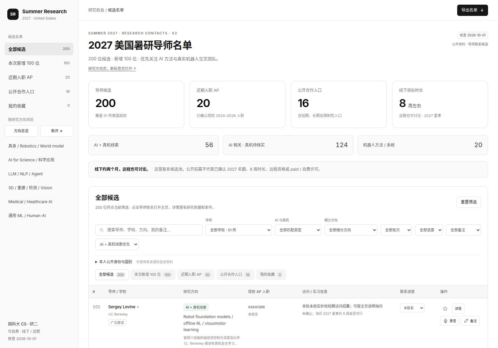

# Summer Research 2027

面向 2027 美国暑期研究联系的导师浏览工具。React + TypeScript + Vite 前端，FastAPI 后端，白灰色仪表盘布局。

第二版保留原始 100 位，再增加 100 位候选，共 **200 位、51 所学校**。新增检索侧重 AI 方法与物理机器人交叉，区分机器人基础模型、视觉与视频学习、强化学习、物理推理、人机协作和学习控制。学校官网教师页、学校个人主页和实验室页都可以作为资料来源。

**这是联系候选池，核查日期为 2026-10-01，不是已确认的 2027 招聘名单。** 真机线索可来自历史项目或合作，不能保证当前组内设备、在校指导时间、八周访问资格或经费。



## 功能

- 200 位候选与“本次新增 100 位”快捷入口；原始姓名和编号保持兼容。
- “AI + 真机线索”“AI 相关 · 真机待核实”“机器人方法 / 系统”匹配筛选。新增名单分别为 56、24、20 位；原始 100 位本轮未重新核查真机证据，单独标为待核实。
- 独立研究方向页面，支持新标签页打开。细分方向可以交叉归类，卡片人数随学校、匹配类型和其他筛选更新。
- 学校筛选显示各校人数，可以组合方向、匹配、关键词、联系进度和备注条件。筛选链接可复制、刷新或独立打开。
- 导师详情包含研究依据、公开主页、任职、访问时长、联系方式与条件说明。
- 收藏、联系状态、文字备注与原音录制。文字存在 localStorage，音频存在 IndexedDB，仅保存在当前浏览器。
- 导出当前筛选的全部记录，包含所有分页、研究来源和文字备注。录音单独下载，CSV 只包含数量与文件名。
- 本人公开身份与国别筛选：族裔、性别、国籍仅使用本人明确公开且有来源的信息，当前尚未核实，全部为未知。学校所在国家为美国，不代表导师国籍。不会依据姓名、照片、代词、出生地或教育经历推断身份。

## 直接打开

下载仓库后，用浏览器打开根目录的 **[index.html](index.html)**。它包含完整 React 应用和资料快照，无需启动服务或下载前端依赖。外部教师主页需要网络。

根页面是名单；“研究方向页，新标签页打开”或侧栏“新开”进入方向页面。也可以使用链接中的 `#directions`，例如 `#directions?school=MIT&fit=ai-real`。

普通静态服务器没有 `/api/contacts` 时，点击“打开内置的 200 位名单”。页面会明确标记内置模式。

## 运行 React + FastAPI

需要 Node.js 22.12+ 和 Python 3.10+。以下命令适用于 Linux/macOS：

```sh
git clone https://github.com/MVChem/summer-research-2027.git
cd summer-research-2027
npm --prefix frontend ci --include=dev
npm --prefix frontend run build
python -m venv backend/.venv
backend/.venv/bin/python -m pip install -r backend/requirements.txt
backend/.venv/bin/python -m uvicorn backend.app.main:app --host 127.0.0.1 --port 8790
```

打开 `http://127.0.0.1:8790`，API 文档位于 `/docs`。FastAPI 提供构建后的前端和名单 API：

- `/api/contacts`：整份名单和元数据。
- `/api/browse?school=MIT&fit=ai-real`：组合筛选。
- `/api/directions?school=MIT`：按学校统计细分方向。
- `/api/contacts/export?school=MIT&fit=ai-real`：全部匹配记录的 CSV。

开发时在仓库根运行后端 `--port 8000`，在 `frontend/` 运行 `npm run dev`；Vite 使用 `/api` 代理。

## 数据与重建

| 文件 | 内容 |
|---|---|
| `data/contacts.json` | 当前 200 位结构化数据 |
| `data/archive/contacts_100.v1.json` | 第一版原始资料 |
| `data/source_inputs/expansion_100.tsv` | 新增 100 位的人工整理输入 |
| `scripts/extend_dataset.py` | 分组规则、任职核查、研究来源和导出 |
| `contacts_200.csv` / `contacts_200.xlsx` | 完整表格 |
| `shortlist_200.md` | 200 位候选及来源链接 |
| `contacts_100.*` / `shortlist_100.md` | 第一版名单 |

补充来源或修正数据后：

```sh
backend/.venv/bin/python -m pip install -r scripts/requirements.txt
backend/.venv/bin/python scripts/extend_dataset.py
npm --prefix frontend run build
backend/.venv/bin/python scripts/pack_html.py
backend/.venv/bin/python scripts/verify_data.py
```

`scripts/create_dataset.py` 可以先重建第一版导出，再调用扩展构建。Excel 生成需要 `xlsxwriter`；缺少时仍生成 JSON、CSV 和 Markdown。

`scripts/check_expansion_sources.py` 是可选的公共页面读取检查。它的本地网页缓存、搜索记录和完整页面文本均不提交仓库。遇到 403、超时或网页迁移时，应人工核对学校页或本人页，不能仅凭 HTTP 状态判断任职。

## 验证

`npm run build` 包含 TypeScript 检查。`scripts/verify_data.py` 核对候选去重、原始编号、转校修正、组合筛选和身份来源规则。GitHub Actions 自动运行构建与数据检查。

`scripts/verify_expansion.cjs` 检查独立页面、新标签页、筛选链接、导出和 API；`scripts/verify_notes.cjs` 检查录音、备注、存储错误和麦克风释放。需要安装 Playwright，使用 `PLAYWRIGHT_MODULE` 与 `CHROMIUM_PATH` 可指定本地安装路径。验证浏览器使用独立测试上下文，不读取使用者浏览器数据。

## 录音与联系记录

同一访问地址刷新后会保留记录；`file://`、不同域名、端口和设备拥有不同存储空间。清理站点数据会清除记录，重要录音请下载。录音需要允许麦克风；远程访问需使用 HTTPS，电脑本地可使用 localhost 或浏览器支持的文件页面。

目前只保存原音，文字手动输入，不发送录音、不自动转写、不发送邮件。公开仓库不包含使用者的浏览器录音、备注或联系状态。

## 资料贡献与许可证

欢迎以 issue 或 PR 提供官方教师页、本人公开研究主页、具体真机项目和任职修正。招募信息要区分 PhD、本校学生、长期访问与外校短期暑研。新增 AP 年份需要公开来源；身份字段需要本人明确公开的来源，不能靠推断填入。

代码和原创整理文字采用 [MIT License](LICENSE)。链接的网站、论文、照片与机构标识保留各自权利，见 [THIRD_PARTY_NOTICES.md](THIRD_PARTY_NOTICES.md)。
